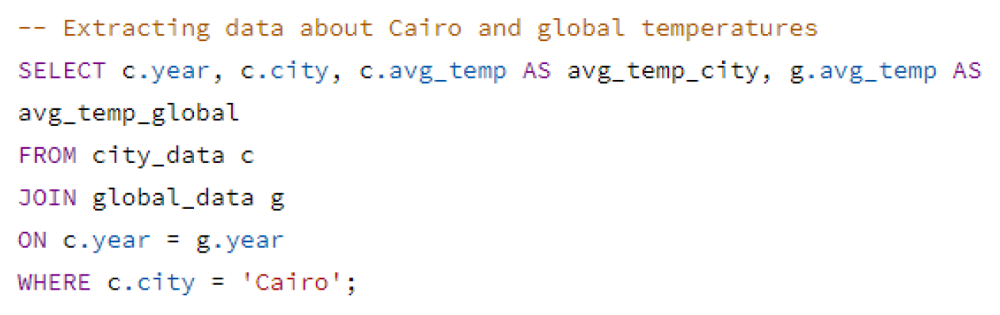

## Getting the data: 
Data were extracted from the temperatures database using Udacity's workspace and downloaded as a csv file.
The following SQL queries were used:




## Analyzing the data:
### Analysis of data was done in R and was performed in RStudio:  
- The csv file was imported using the `read_csv()` function provided by
the `readr` package.  
- 5, 10, and 20 years moving averages were calculated for both Cairo and global
average temperatures using the `rollmean()` function provided by the `zoo` package.

```{r echo=TRUE, message=FALSE, warning=FALSE, paged.print=FALSE}
library(readr)
library(tidyr)
library(dplyr)
library(ggplot2)
library(zoo)

#importing the data set 
cairo <- read_csv("cairo_results.csv")
glimpse(cairo)

#calculating 5,10, and 20 year moving averages using the rollmean function
#provided by zoo package
cairo_ma <- cairo %>%
  mutate(cairo_05 = rollmean(avg_temp_city, 5, fill = NA ),
         cairo_10 = rollmean(avg_temp_city, 10, fill = NA ),
         cairo_20 = rollmean(avg_temp_city, 20, fill = NA ),
         global_05 = rollmean(avg_temp_global, 5, fill = NA ),
         global_10 = rollmean(avg_temp_global, 10, fill = NA ),
         global_20 = rollmean(avg_temp_global, 20, fill = NA ))
glimpse(cairo_ma)

# subsetting and reshaping each moving average for comparison
cairo_ma05 <- cairo_ma %>%
  select( year, cairo_05, global_05) %>%
  gather( key= "level", value="Temperature", cairo_05, global_05)
cairo_ma10 <- cairo_ma %>%
  select( year, cairo_10, global_10) %>%
  gather( key= "level", value="Temperature", cairo_10, global_10)
cairo_ma20 <- cairo_ma %>%
  select( year, cairo_20, global_20) %>%
  gather( key= "level", value="Temperature", cairo_20, global_20)
```


- Exploratory visualization for the three moving averages was performed for comparison
using the `ggplot2` visualization package.


```{r warning=FALSE}
# visualizing and comparing the 05-year moving average of cairo and global 
# temperature
ggplot(cairo_ma05 , aes(x= year, y= Temperature , color = level))+
  geom_line()+
  labs(
    x="Year",
    y="Average Temperature in °C",
    title="Cairo/Global Weather Trends",
    subtitle = "A 05-year Moving Average")+
  theme(plot.title = element_text(hjust = 0.5),
        plot.subtitle = element_text(hjust = 0.5))

# visualizing and comparing the 10-year moving average of cairo and global 
# temperature
ggplot(cairo_ma10 , aes(x= year, y= Temperature , color = level))+
  geom_line()+
  labs(
    x="Year",
    y="Average Temperature in °C",
    title="Cairo/Global Weather Trends",
    subtitle = "A 10-year Moving Average")+
  theme(plot.title = element_text(hjust = 0.5),
        plot.subtitle = element_text(hjust = 0.5))

# visualizing and comparing the 20-year moving average of cairo and global 
# temperature
ggplot(cairo_ma20 , aes(x= year, y= Temperature , color = level))+
  geom_line()+
  labs(
    x="Year",
    y="Average Temperature in °C",
    title="Cairo/Global Weather Trends",
    subtitle = "A 20-year Moving Average")+
  theme(plot.title = element_text(hjust = 0.5),
        plot.subtitle = element_text(hjust = 0.5))

```

- From the above visualizations we can see that in the case of a 20-year moving average, a much
more smoother lines are obtained in which trends can be easily observed but some details could be lost,
such as the early peak at the beginning.
- In case of a 10-year moving average, we have a clear trend line while still preserving details we could
use.

### Calculating and comparing the correlation coefficients: 
- Correlation coefficients were calculated for average and 10-year moving average
between Cairo and global temperatures.
- Pearson correlation coefficient was used, and it was calculated by the `cor()`
function provided by the base R `stats` package.

```{r message=FALSE, warning=FALSE}
# correlation coefficient between the average for cairo and global 
# temperature
pearson <- cor(cairo_ma$avg_temp_city, cairo_ma$avg_temp_global,
               method= "pearson")
pearson

# ploting using ggplot
ggplot(cairo_ma, aes(x= avg_temp_city, y= avg_temp_global)) +
  geom_point() +
  geom_smooth(method = lm, 
              se = FALSE)+
  labs(x= "Cairo Average Temperature in °C",
       y= "Global Average Temperature in °C",
       title = "Cairo/Global Average Temperature")


# correlation coefficient between the 10-year moving average for cairo and 
# global temperature
pearson_ma <- cor(cairo_ma$cairo_10, cairo_ma$global_10, 
                  method= "pearson", use= "complete.obs" )
pearson_ma

# ploting using ggplot
ggplot(cairo_ma, aes(x= cairo_10, y= global_10)) +
  geom_point() +
  geom_smooth(method = lm, 
              se = FALSE)+
  labs(x= "Cairo Average Temperature in °C",
       y= "Global Average Temperature in °C",
       title = "Cairo/Global 10-year moving Average Temperature")

```

## Observations:
### The provided observations were made from the 10-year moving average line chart.

```{r message=FALSE, warning=FALSE}
ggplot(cairo_ma10 , aes(x= year, y= Temperature , color = level))+
  geom_line()+
  labs(
    x="Year",
    y="Average Temperature in °C",
    title="Cairo/Global Weather Trends",
    subtitle = "A 10-year Moving Average")+
  theme_classic()+
  theme(plot.title = element_text(hjust = 0.5),
        plot.subtitle = element_text(hjust = 0.5))
  

```

- From the above line chart we can see that the temperature in Cairo is on average hotter 
than the average of the global temperature.
- The difference in average between Cairo and global temperature is consistent through out the chart.
- There is a sharp peak at the beginning of both Cairo and global temperature indicating a sudden increase in temperature that then began to stabilize again.
- Unlike the sharp peak that is present in both line, there is a valley of a sudden drop in temperature
in the Cairo line. both the peak and the valley(in case of Cairo), could be due to some measurement errors in the past (both are in the early 1800s) or could be not, but the peak is present in both lines.
- The increase in the average temperature is steady and on the rise in both cases, indicated by the rising
lines and the strong positive correlation coefficient [0.9325437] between the moving average of Cairo and global temperature.
- This trend shows an overall increase in temperature that has been consistent over the last few hundred years, from which we can expect even more increase in temperature in the coming decades (unless something 
is done about climate change, of course).
 

## Comparing temperature trend in Cairo and other cities:
### Here we plot and visualize the weather trends in Cairo and five other cities.

```{r echo=TRUE, message=FALSE, warning=FALSE}

# importing the data set
cities <- read.csv("cities_results.csv")
glimpse(cities)

# calculating 10-year moving averages using the rollmean function
# provided by zoo package
cities_ma <- cities %>%
  mutate(city_10 = rollmean(avg_temp_city, 10, fill = NA )) %>%
  select( year, city, city_10)
  
glimpse(cities_ma)

# visualizing the 10-year moving average of different cities
ggplot(cities_ma , aes(x= year, y= city_10, color= city))+
  geom_line()+
  labs(
    x="Year",
    y="Average Temperature in °C",
    title="Local/Global Weather Trends",
    subtitle = "A 10-year Moving Average")+
  theme_classic()+
  theme(plot.title = element_text(hjust = 0.5),
        plot.subtitle = element_text(hjust = 0.5))
```

### Some strange observations are more clear in this graph:
- There is a steep decrease in the average temperature in case of Cairo and Chicago during the past few years (was not as clear in case of Cairo when we were comparing with global temperature). There is a big chance of this being an error.
- Some lines are more smoother than others, for example Tokyo, which show a continuous increase in average temperature through the past years.
- Of the six cities, still Cairo is the one with hottest temperature on average compared with the others while Moscow is the coldest.
- The peak at the early 1800s is found in all the cities except Tokyo, which has no temperature information for this period.
- Overall, a consistent trend of increase in the average temperature is found in all the cities, some more prominent than others.
